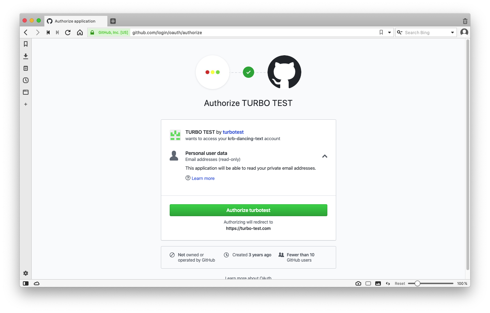
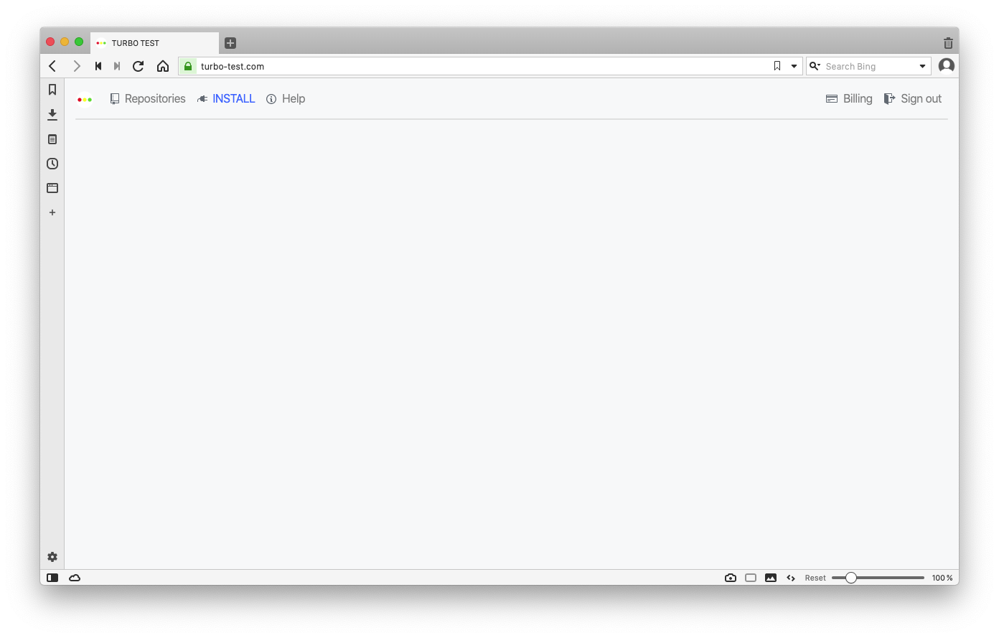
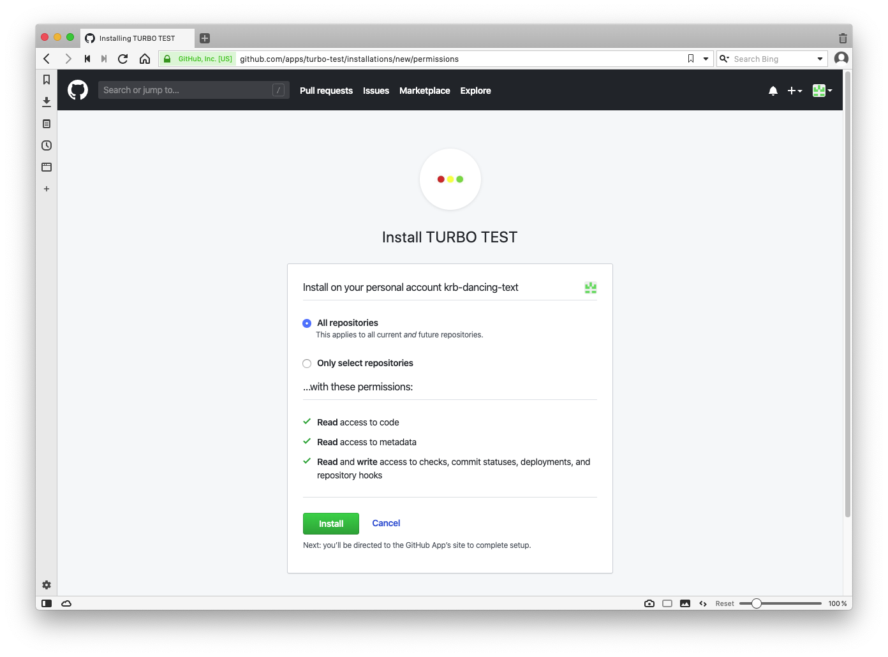
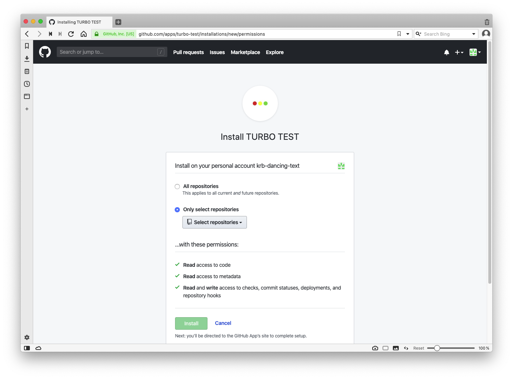
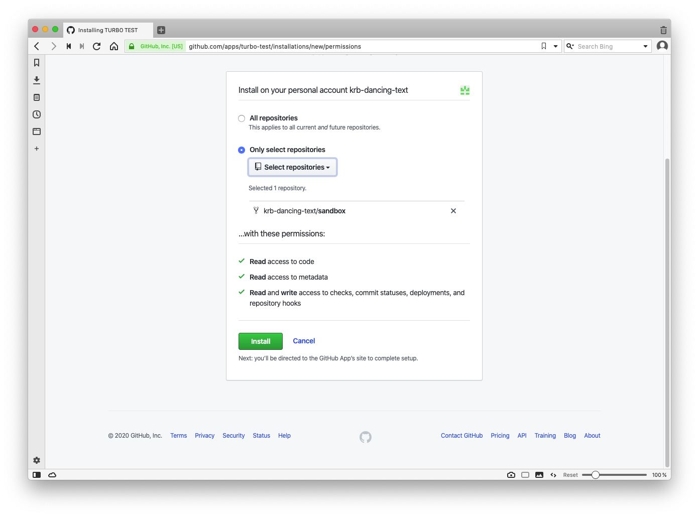
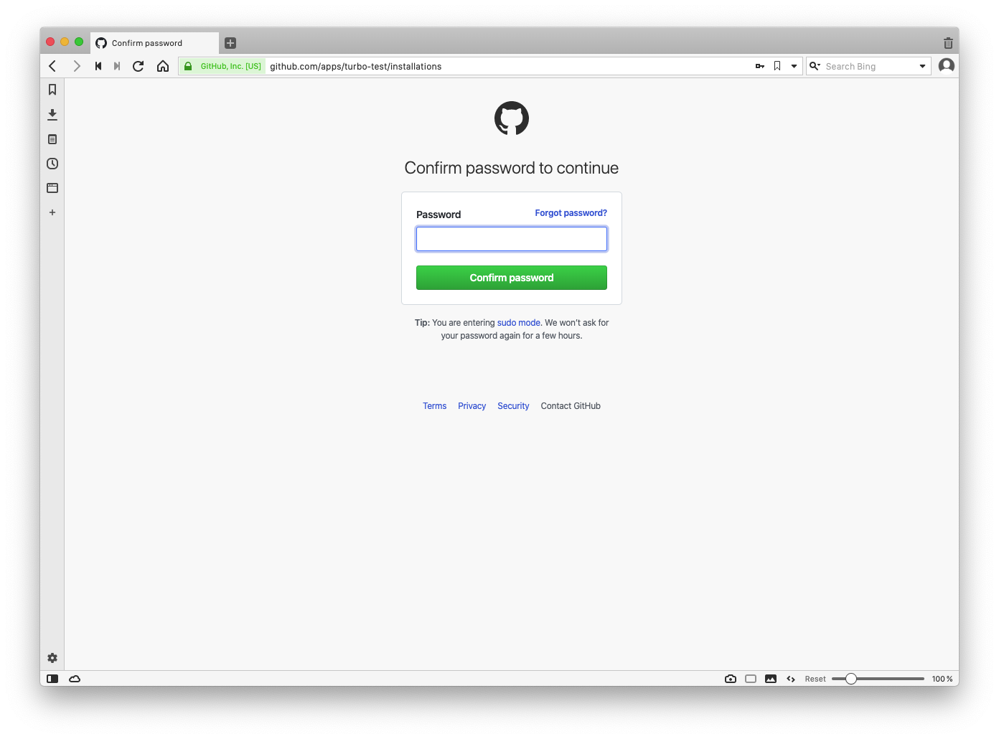
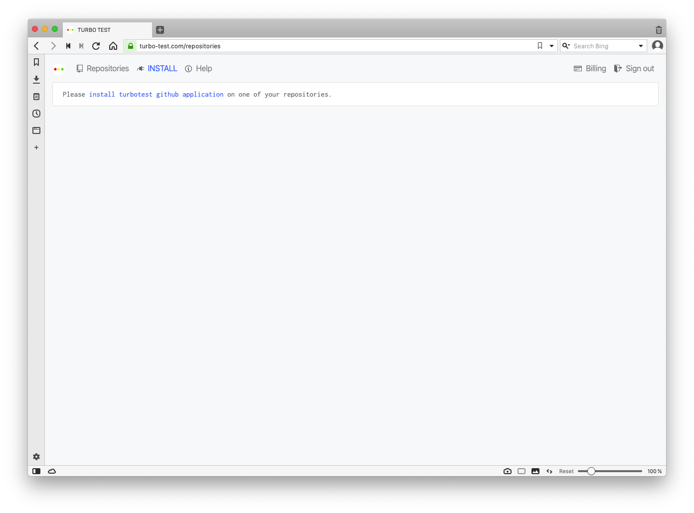

# Installing the TurboTest application to your Github account

Open [https://github.com](https://github.com) in your web browser, and log in to your Github account.

Open a new tab or window in the browser, and go to [https://turbo-test.com](https://turbo-test.com). 
You will be redirected to a github.com authorization page:

Click the green "Authorize turbotest" button. You will be returned to turbo-test.com: 

Click the blue "Install" link at the top.

Select "All repositories" or "Only select repositories". 

If you choose "Only select repositories", click the "Select repositories" button and select the repository/ies: 

After making a selection, you will be brought back to a screen like the one below.

Note the feedback under the "Select repositories button" showing the number of repos and their names: 

Click the green "Install" button at the bottom of the page.

Input your password and click the green "Confirm password" button: 

You will be brought to the Turbo Test page. If you see a message saying "Please install turbotest github application on one of your repositories", refresh the page. (This will be fixed soon.) 

That's it, you're done. You will see all the repos on which you installed Turbo Test with the text "waiting for first build..." beside them.

